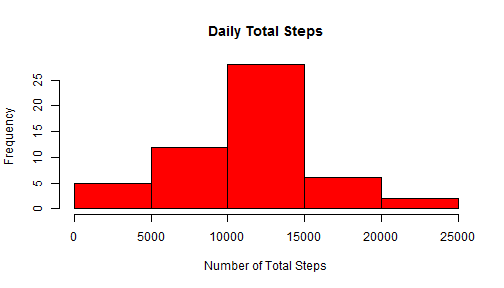
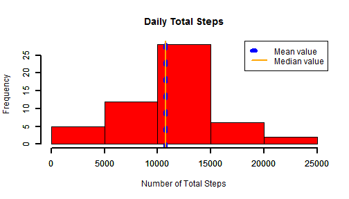
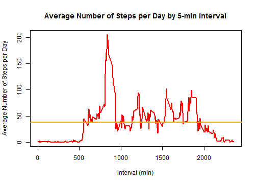
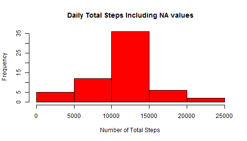
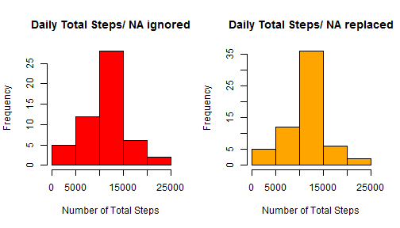
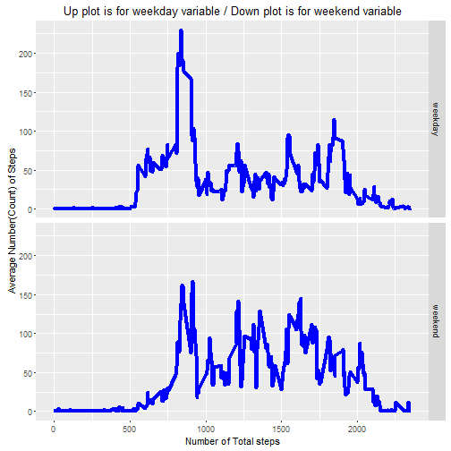

## Reproducible Research Course   - *Project 1*
#### *Set the working directory*
##### Check for the working directory:
##### getwd()

##### Set a new working directory for this assignment:
##### setwd("I:/Coursera/Data Science Specialization/Course5_Reproducible Research/Assignments/Activity monitoring data")

#### *Clean the environment*.

rm(list = ls())

#### *Install some R packages and upload libraries*.

##### install.packages("knitr")
##### install.packages("markdown")
##### install.packages("dplyr")

##### library(knitr)
##### library(markdown)
##### library(dplyr)


##### **Section 1: Upload data. Pre-process data.**


```r
### Upload data.

activity.monitoring.data <- read.table("activity.csv", sep = ",", header = TRUE, stringsAsFactors = FALSE)
```


```r
### Pre-process data.

head(activity.monitoring.data)
```

```
##   steps       date interval
## 1    NA 2012-10-01        0
## 2    NA 2012-10-01        5
## 3    NA 2012-10-01       10
## 4    NA 2012-10-01       15
## 5    NA 2012-10-01       20
## 6    NA 2012-10-01       25
```

```r
tail(activity.monitoring.data)
```

```
##       steps       date interval
## 17563    NA 2012-11-30     2330
## 17564    NA 2012-11-30     2335
## 17565    NA 2012-11-30     2340
## 17566    NA 2012-11-30     2345
## 17567    NA 2012-11-30     2350
## 17568    NA 2012-11-30     2355
```

```r
names(activity.monitoring.data)
```

```
## [1] "steps"    "date"     "interval"
```

```r
str(activity.monitoring.data)
```

```
## 'data.frame':	17568 obs. of  3 variables:
##  $ steps   : int  NA NA NA NA NA NA NA NA NA NA ...
##  $ date    : chr  "2012-10-01" "2012-10-01" "2012-10-01" "2012-10-01" ...
##  $ interval: int  0 5 10 15 20 25 30 35 40 45 ...
```

```r
dim(activity.monitoring.data)
```

```
## [1] 17568     3
```


```r
### Change the variable "date" from factor to date.

activity.monitoring.data$date<- as.Date(activity.monitoring.data$date)
str(activity.monitoring.data)
```

```
## 'data.frame':	17568 obs. of  3 variables:
##  $ steps   : int  NA NA NA NA NA NA NA NA NA NA ...
##  $ date    : Date, format: "2012-10-01" "2012-10-01" ...
##  $ interval: int  0 5 10 15 20 25 30 35 40 45 ...
```


```r
options(dplyr.width = Inf)

#tbl_df(activity.monitoring.data)
library(dplyr)
```

```
## Warning: package 'dplyr' was built under R version 3.2.5
```

```
## 
## Attaching package: 'dplyr'
```

```
## The following objects are masked from 'package:stats':
## 
##     filter, lag
```

```
## The following objects are masked from 'package:base':
## 
##     intersect, setdiff, setequal, union
```

```r
glimpse(activity.monitoring.data)
```

```
## Observations: 17,568
## Variables: 3
## $ steps    <int> NA, NA, NA, NA, NA, NA, NA, NA, NA, NA, NA, NA, NA, N...
## $ date     <date> 2012-10-01, 2012-10-01, 2012-10-01, 2012-10-01, 2012...
## $ interval <int> 0, 5, 10, 15, 20, 25, 30, 35, 40, 45, 50, 55, 100, 10...
```

```r
#view(activity.monitoring.data)
summary(activity.monitoring.data)
```

```
##      steps             date               interval     
##  Min.   :  0.00   Min.   :2012-10-01   Min.   :   0.0  
##  1st Qu.:  0.00   1st Qu.:2012-10-16   1st Qu.: 588.8  
##  Median :  0.00   Median :2012-10-31   Median :1177.5  
##  Mean   : 37.38   Mean   :2012-10-31   Mean   :1177.5  
##  3rd Qu.: 12.00   3rd Qu.:2012-11-15   3rd Qu.:1766.2  
##  Max.   :806.00   Max.   :2012-11-30   Max.   :2355.0  
##  NA's   :2304
```

##### **Section 2: Calculate and plot the mean of the total number of steps per day (the missing values NA are ignored for this section).**

##### **Step 1: Calculate the total number of steps taken per day.**


```r
steps.per.day <- aggregate(steps ~ date, activity.monitoring.data, na.rm = TRUE, sum)
head(steps.per.day)
```

```
##         date steps
## 1 2012-10-02   126
## 2 2012-10-03 11352
## 3 2012-10-04 12116
## 4 2012-10-05 13294
## 5 2012-10-06 15420
## 6 2012-10-07 11015
```

```r
tail(steps.per.day)
```

```
##          date steps
## 48 2012-11-24 14478
## 49 2012-11-25 11834
## 50 2012-11-26 11162
## 51 2012-11-27 13646
## 52 2012-11-28 10183
## 53 2012-11-29  7047
```

##### **Step 2: Plot the histogram of data.**


```r
hist(steps.per.day$steps, breaks = 7, main = paste("Daily Total Steps"), col = "red", xlab = "Number of Total Steps")
```




```
## png 
##   2
```

##### **Step 3: Calculate and report the mean and median of the total number of steps taken per day.**


```r
mean.steps.per.day <- mean(steps.per.day$steps, na.rm = TRUE)
median.steps.per.day <- median(steps.per.day$steps, na.rm = TRUE)
```


```r
### The mean value of the total number of steps taken per day is:
print(mean.steps.per.day)
```

```
## [1] 10766.19
```

```r
### The median value of the total number of steps taken per day is:
print(median.steps.per.day)
```

```
## [1] 10765
```

##### **Step 4 (optional): Include the mean and median of the total number of steps taken per day in the hystogram.**


```r
hist(steps.per.day$steps, breaks = 7, main = paste("Daily Total Steps"), col = "red", xlab = "Number of Total Steps")
abline(v = mean.steps.per.day, col = "blue", lty = 3, lwd = 6)
abline(v = median.steps.per.day, col = "orange", lwd = 2.5)

axis(side = 1, lwd = 2)
axis(side = 2, lwd = 2)

legend('topright', c('Mean value', 'Median value'), col = c("blue", "orange"), lty = c(3, 1), lwd = c(6, 2.5))
```




```
## png 
##   2
```

##### **Section 3: Calculate and plot the average daily activity pattern by interval.**

##### **Step 1: Make a time series plot of the "5-min interval" (x-axis) and the average number of the steps taken, averaged across all days (y-axis).**


```r
steps.per.interval <- aggregate(steps ~ interval, activity.monitoring.data, na.rm = TRUE, mean)
plot(steps.per.interval$interval, steps.per.interval$steps, type = "l", col = 'red', lwd = 2, xlab = "Interval (min)", ylab = "Average Number of Steps per Day", main = "Average Number of Steps per Day by 5-min Interval")
abline(h=mean(steps.per.interval$steps, na.rm = TRUE), col = "orange", lwd = 2)
```



```
## png 
##   2
```

##### **Step 2: The "5-min interval", on average across all the days in the dataset, that contains the maximum number of steps.**


```r
maximum.steps.interval <- steps.per.interval[which.max(steps.per.interval$steps),1]
maximum.steps.value <- max(steps.per.interval$steps)
```


```r
### The interval that contains the max number of steps is:
print(maximum.steps.interval)
```

```
## [1] 835
```


```r
### The max number of steps is:
print(maximum.steps.value)
```

```
## [1] 206.1698
```

##### **Section 4: Impute missing values.**

##### **Step 1: Calculate and report the total number of missing values (NA) in the dataset.**


```r
sum1 <- sum(is.na(activity.monitoring.data$steps))
```


```r
### The total number of missing values (NA) in the dataset is:
print(sum1)
```

```
## [1] 2304
```

##### **Step 2: Devise a strategy for filling in all of the missing data (NA) in the dataset.**

Let's impute missing values (NA) based on average (mean) number of steps in particular 5-minutes interval.

##### **Step 3: Create a new dataset that is equal to the original dataset but with the missing data (NA) filled in base on the chosen strategy.**


```r
activity.monitoring.newdata <- activity.monitoring.data
number.of.na <- is.na(activity.monitoring.newdata$steps)
average.interval<- tapply(activity.monitoring.newdata$steps, activity.monitoring.newdata$interval, mean, na.rm = TRUE, simplify = TRUE)
activity.monitoring.newdata$steps[number.of.na] <- average.interval[as.character(activity.monitoring.newdata$interval[number.of.na])]
```


```r
### Checking the new dataset:
head(activity.monitoring.newdata)
```

```
##       steps       date interval
## 1 1.7169811 2012-10-01        0
## 2 0.3396226 2012-10-01        5
## 3 0.1320755 2012-10-01       10
## 4 0.1509434 2012-10-01       15
## 5 0.0754717 2012-10-01       20
## 6 2.0943396 2012-10-01       25
```

```r
tail(activity.monitoring.newdata)
```

```
##           steps       date interval
## 17563 2.6037736 2012-11-30     2330
## 17564 4.6981132 2012-11-30     2335
## 17565 3.3018868 2012-11-30     2340
## 17566 0.6415094 2012-11-30     2345
## 17567 0.2264151 2012-11-30     2350
## 17568 1.0754717 2012-11-30     2355
```

```r
names(activity.monitoring.newdata)
```

```
## [1] "steps"    "date"     "interval"
```

```r
str(activity.monitoring.newdata)
```

```
## 'data.frame':	17568 obs. of  3 variables:
##  $ steps   : num  1.717 0.3396 0.1321 0.1509 0.0755 ...
##  $ date    : Date, format: "2012-10-01" "2012-10-01" ...
##  $ interval: int  0 5 10 15 20 25 30 35 40 45 ...
```

```r
dim(activity.monitoring.newdata)
```

```
## [1] 17568     3
```

##### **Step 4: Make a histogram of the total number of steps taken each day.**


```r
steps.per.day.new <- aggregate(steps ~ date, activity.monitoring.newdata, sum)
hist(steps.per.day.new$steps, main = paste("Daily Total Steps Including NA values"), col = "red", xlab = "Number of Total Steps")
```




```
## png 
##   2
```

##### **Step 5: Calculate and report the mean and median total number of steps taken each day.**


```r
mean.steps.per.day.new <- mean(steps.per.day.new$steps)
median.steps.per.day.new <- median(steps.per.day.new$steps)
```


```r
### The mean value of the total number of steps taken per day is:
print(mean.steps.per.day.new)
```

```
## [1] 10766.19
```

```r
### The median value of the total number of steps taken per day is:
print(median.steps.per.day.new)
```

```
## [1] 10766.19
```

##### **Step 6 (optional): Comparison between the histogram with replaced NA values and the histogram with ignored NA values**


```r
par(mfrow = c(1,2))
hist(steps.per.day$steps, breaks = 7, main = paste("Daily Total Steps/ NA ignored"), col = "red", xlab = "Number of Total Steps")
hist(steps.per.day.new$steps, main = paste("Daily Total Steps/ NA replaced"), col = "orange", xlab = "Number of Total Steps")
```




```r
png(filename = 'plot5.png')
par(mfrow = c(1,2))
hist(steps.per.day$steps, breaks = 7, main = paste("Daily Total Steps/ NA ignored"), col = "red", xlab = "Number of Total Steps")
hist(steps.per.day.new$steps, main = paste("Daily Total Steps/ NA replaced"), col = "orange", xlab = "Number of Total Steps")
dev.off()
```

```
## png 
##   2
```

##### **Step 7 (optional): Comparison between the calculated mean and median for the dataset with replaced NA values and the calculated mean and median for the dataset with ignored NA values**

a) Calculated mean and median for the dataset with ignored NA values:

mean = 10766.19

median = 10765

b) Calculated mean and median for the dataset with replaced NA values:

mean = 10766.19

median = 10766.19

We can see that it is a small different between the mean and the median when the NA values are ignored. However, with the chosen strategy to replace the NA values, the mean and median become equal. Also, the mean does not change when the NA values are replaced, thus the strategy taken into account is good enough.

##### **Section 4: Comparison between the activity pattern in weekdays and the activity pattern in weekends.**

##### **Step 1: Create a new factor variable in the dataset with two levels - "weekdays" and "weekends" - indicating weather a given date is a weekday or a weekend day.**


```r
### Create a new variable called WeekType for Weekday & Weekend:
activity.monitoring.newdata$WeekType <-  ifelse(as.POSIXlt(activity.monitoring.newdata$date)$wday %in% c(0,6), 'weekend', 'weekday')
head(activity.monitoring.newdata)
```

```
##       steps       date interval WeekType
## 1 1.7169811 2012-10-01        0  weekday
## 2 0.3396226 2012-10-01        5  weekday
## 3 0.1320755 2012-10-01       10  weekday
## 4 0.1509434 2012-10-01       15  weekday
## 5 0.0754717 2012-10-01       20  weekday
## 6 2.0943396 2012-10-01       25  weekday
```

##### **Step 2: Make a panel plot containing a time series plot of the 5-min interval (x-axis) and the average number of steps taken, averaged across all weekday days or weekend days (y-axis)**


```r
activity.monitoring.newdata1 <- aggregate(steps ~ interval + WeekType, data = activity.monitoring.newdata, mean)

library(ggplot2)
```

```
## Warning: package 'ggplot2' was built under R version 3.2.5
```

```r
library(gridExtra)
```

```
## Warning: package 'gridExtra' was built under R version 3.2.5
```

```
## 
## Attaching package: 'gridExtra'
```

```
## The following object is masked from 'package:dplyr':
## 
##     combine
```

```r
ggplot(activity.monitoring.newdata1, aes(interval, steps)) + 
    geom_line(size = 1.5, color = "blue") + 
    ggtitle("Up plot is for weekday variable / Down plot is for weekend variable") +
    facet_grid(WeekType ~ .) +
   # facet_grid(hospital ~ .) +
    xlab("Number of Total steps") + 
    ylab("Average Number(Count) of Steps")
```



```
## png 
##   2
```
